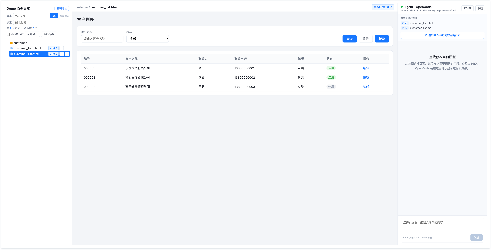
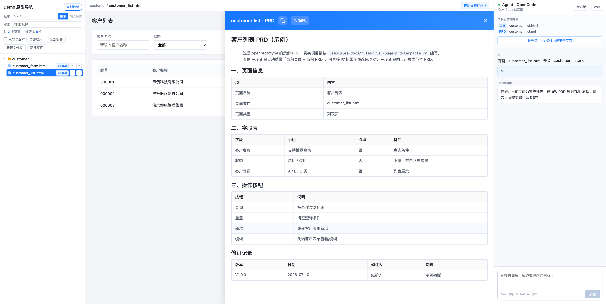

<div align="center">

# OpenPrototype

**English** | [简体中文](README.zh-CN.md)

**A local prototyping workbench — navigation tree on the left · live preview in the middle · an AI Agent on the right**

Let product managers run "requirements → PRD → HTML prototype" as a single closed loop, with the AI sitting right next to the prototype and editing pages against their PRD.

*A local prototyping workbench: navigation tree · live preview · an AI agent that edits your HTML prototypes against their PRD.*


</div>

<p align="center" style="display: flex; justify-content: center; gap: 24px;">
  
  
</p>

---

## Why it exists

The recurring pain points when a PM builds prototypes:

- **PRD and prototype live apart** — the doc is in Word / Axure, the prototype is somewhere else. Changing one field means manually syncing several places, and they drift further apart the more you edit.
- **AI can write code, but doesn't know your rules** — hand a prototype to a general-purpose AI and it rewrites whole pages, names things inconsistently, hardcodes status labels, and breaks existing interactions.
- **Pages are scattered at review time** — dozens of prototype pages with no unified entry point; you find pages and track versions from memory.

`openprototype` folds these three things into **one local workbench**:

1. **PRD (`.md`) and prototype (`.html`) sit side by side in the same directory** — browse in one place, keep them aligned in one place.
2. **The AI Agent on the right automatically carries "current page + current PRD" context.** Say "change field X to XX" and it edits only the relevant part instead of rewriting the whole page; it can also pick up the **red-marked** incremental changes in the PRD and land them precisely.
3. **A built-in red-line checker** (script order, data layer, status constants, font stack, `mode=view` physical hiding) runs automatically after every change, making it hard for the AI's output to drift off-spec.

> In one sentence: **a local workbench with guardrails, built for "PM + AI prototyping."**

---

## ✨ Features

- 🌲 **Navigation tree** — scans the product directory to auto-generate a page tree, with fuzzy title search, version badges (read from the PRD version table), and review markers.
- 👁 **Live preview** — the middle iframe renders the prototype page directly; click on the left and see it instantly.
- 🤖 **Context-aware AI Agent** — connects to your local [OpenCode](https://opencode.ai); every message automatically carries the current page + PRD path, with one-click "update the page per the PRD's red-marked content."
- 🧱 **Zero-backend data layer** — `BaseDataManager` does CRUD via localStorage, so prototypes ship with interactive fake data and no database to spin up.
- ✅ **Automated red-line checks** — static rules + Playwright smoke tests run right after you edit, pulling the AI back to spec.
- 📦 **Scaffold distribution** — `create` starts a project from scratch, `init` grafts it into an existing project, `add-product` adds a product, and `npm update` upgrades the framework.
- 🖥 **Cross-platform** — macOS / Windows / Linux; the OpenCode path is auto-detected.

---

## 🎯 Who it's for / Use cases

**A good fit for**
- **B2B / back-office product managers**: need to quickly build high-fidelity, interactive prototypes and keep the PRD and prototype always in sync.
- **Small teams / solo developers**: want AI to speed up prototype iteration without letting it rewrite things randomly or drift in style.
- **Teams that want to codify their standards**: put your own PRD templates and UI guidelines into `rules/` and have the AI produce work to your standard.

**Typical scenarios**
| Scenario | How to use it |
|----------|---------------|
| Go from requirements to prototype quickly | Write the PRD → have the Agent generate/fill in pages per the PRD → preview and debug |
| Incrementally edit a prototype per the PRD | **Red-mark** the parts to change in the PRD → click "Update page per PRD red-marked content" → the Agent edits only that part |
| Keep PRD and prototype consistent | For any field/rule change, the Agent updates the page + PRD + fake data together |
| Requirement review | Browse all pages in one place via the navigation tree; version badges make versions align at a glance |
| Roll out team standards | Write standards into `rules/` + `CONVENTIONS.md`; the checker enforces the red lines |

**Not a fit for**: writing production backend code, database design, or formal frontend engineering (this is a tool for the "prototype + PRD" phase, not a delivery scaffold).

---

## 🚀 Quick start

> Prerequisite: Node ≥ 16. The AI panel additionally needs local [OpenCode](https://opencode.ai) (see the next section; can be installed later).

### Scenario ①: Start a project from scratch

```bash
npx openprototype create myapp
cd myapp
npm install
npm run serve
# Open http://127.0.0.1:8082/product/demo/pc/index.html
```

The first run ships with an interactive demo product (customer list + form + PRD); just follow it to add your own pages.

### Scenario ②: Graft into an existing project (non-destructive)

```bash
cd your-project
npm i openprototype
npx openprototype init          # Only adds missing files and merges package.json scripts; never overwrites your existing content
npx openprototype add-product shop
npm run serve
```

---

## 🤖 How the AI Agent works

The right-hand panel is essentially **a context-aware shell around the local OpenCode inside your project**:

```
You type in the panel  ──▶  local server (/api/agent)  ──▶  OpenCode (127.0.0.1)
     ▲                          │  Auto-injects: current page path + current PRD path + page red-line conventions
     └──── SSE streaming echo ◀─┘  After the Agent edits files, the preview refreshes automatically
```

- **Context carried automatically**: click any page on the left and the top of the panel shows "This message will carry: page X / PRD Y" — no need to paste paths manually.
- **Incremental update per PRD red-marks**: one click sends the PRD content marked `<span style="color:red">…</span>` as the **only edit scope** to the Agent — it edits only the red-marked parts, treats un-marked history as background, and won't rewrite or "optimize on the side."
- **Local and private**: the server listens on `127.0.0.1` by default; all writes and the Agent interface (`/api/*`) accept local requests only — even if you open the preview to the LAN with `--host 0.0.0.0`, others can only view pages, not edit files or touch the Agent.

### Install OpenCode (prerequisite for the AI panel)

```bash
npx openprototype doctor    # One-shot check of Node / OpenCode / config / Playwright
```

- For installation see https://opencode.ai; once installed, confirm it's on PATH: `which opencode` (Windows: `where opencode`).
- Models / API keys are managed by OpenCode itself (`opencode auth`); this tool only forwards messages.
- Not on PATH: write the absolute path in `opencode.bin` in `proto-kit.config.json`.

**Usable without OpenCode too** — navigation + prototype preview work normally; only the right-hand panel is unavailable.

---

## 🗂 Directory structure and the three-layer separation

```
your-project/
├─ proto-kit.config.json     # Ports / OpenCode / product list (the single config entry)
├─ AGENTS.md                 # Collaboration conventions for the AI (a generic template you own and can edit)
├─ CONVENTIONS.md            # Explanation of the page red lines the checker enforces (coupled to the runtime)
├─ skills/                   # xiaojia (restrained editing) + auto-test (auto-run checks after editing)
├─ rules/                    # Empty directory: put your team's own PRD templates / UI guidelines here
└─ product/<id>/pc/
   ├─ index.html             # Navigation shell (thin, references the /_kit runtime)
   ├─ nav-tree.json          # Page manifest (auto-generated by nav:sync)
   └─ …your prototype pages and PRD.md
```

The three-layer separation determines **who is responsible for updates**, which is also the key to clean upgrades:

| Layer | Content | Ownership | Update method |
|-------|---------|-----------|---------------|
| **Runtime** | Server / shared engine / Agent panel / check scripts | Framework (mounted at `/_kit/`) | `npm update`, one command |
| **Editable assets** | `AGENTS.md` `CONVENTIONS.md` `skills/` + your own `rules/` | You own them | `openprototype update` compares and merges as needed |
| **Business content** | Your product PRDs / prototypes / data | You own them | You maintain them yourself |

> The framework ships only the **minimal generic conventions** (page red lines + editing restraint). Methodology like PRD templates, UI guidelines, and business terminology **belongs to you** — put it in `rules/` and `product/<id>/`; it's not distributed with the framework and won't be overwritten on upgrade.

**Engine fallback resolution**: when a page references `../shared/xxx.js` by relative path and that file doesn't exist under `product/<id>/shared/`, the server automatically falls back to the framework's built-in engine (equivalent to `/_kit/shared/`). Therefore:

- Generic engines (`base-manager.js`, `common/*`, `styles.css`) **don't need to be copied into the product directory** — upgrading the framework upgrades the engine;
- The product directory holds only its own **business components and constants** (`shared/components/`, `shared/constants/`) and design assets — these two directories **never fall back**; if missing they 404 to expose the problem instead of being silently replaced by the framework's generic version;
- For same-named files, **local wins** — when migrating from an old project, you can keep the old local version file by file and switch over gradually.

---

## 🧪 Quality assurance: the red-line checker

`openprototype check` enforces these page red lines (see [CONVENTIONS.md](templates/CONVENTIONS.md) for details):

- Fixed script load order · data must go through `BaseDataManager` (no page-level localStorage)
- Status labels as constants (no hardcoded `<option>`) · no Google Fonts (system font stack)
- `?mode=view` physical hiding (`display:none`, not `disabled`) · no console errors when opening a page

```bash
openprototype check            # Scan all pages
openprototype check --changed  # Scan only git changes
```

The companion `auto-test` skill reminds the AI: **run the checks automatically after every prototype edit, and fix ERRORs before delivering.**

---

## ⚙️ Config `proto-kit.config.json`

```json
{
  "port": 8082,
  "host": "127.0.0.1",                     // Local-only by default; '0.0.0.0' lets the LAN see the preview (/api/* stays local-only)
  "opencode": {
    "bin": "auto",                       // 'auto' auto-detects; you can also write an absolute path
    "model": "deepseek/deepseek-v4-flash",
    "agent": "build",
    "host": "127.0.0.1",
    "port": 4097
  },
  "products": [
    { "id": "demo", "roots": ["pc"] }
  ]
}
```

Environment variables can override temporarily: `PROTO_KIT_PORT` · `PROTO_KIT_HOST` · `OPENCODE_BIN` · `OPENCODE_MODEL` · `OPENCODE_PORT`.
You can also use `node runtime/server.js --port 9000 --host 0.0.0.0` to specify the port / listen address ad hoc.

---

## 📟 Commands

| Command | Purpose |
|---------|---------|
| `openprototype create <dir>` | Create a new project from scratch (with a runnable demo) |
| `openprototype init` | Graft the framework into the current existing project (non-destructive) |
| `openprototype add-product <id>` | Add a product shell (pc by default) |
| `openprototype serve` | Start the local server |
| `openprototype check [--changed]` | Automated checks (static red lines + smoke tests) |
| `openprototype nav:sync` | Scan the product directory and rebuild `nav-tree.json` |
| `openprototype doctor` | Health check (Node / OpenCode / config / Playwright) |
| `openprototype update` | How to update the framework |

---

## 🛣 Roadmap

- [ ] **PageShell**: extract the full page shell (top bar + menu + design system) into a product-agnostic component so list/form/detail/approval page templates work out of the box (the current demo uses self-contained example pages).
- [ ] **H5 (mobile)**: `add-product --h5` mobile support.
- [ ] A `publish` command for one-click publishing / stripping the local dev panel (cross-platform).
- [ ] More example products and page templates.

Feature requests and feedback are welcome in Issues.

---

## 🤝 Contributing

PRs welcome. Development conventions:

- Use only Node built-in modules; the runtime has zero dependencies (the checker's Playwright is a devDependency).
- Run `npm run check` after changing the runtime; after changing the shell / Agent panel, start the server locally and test the three columns for real.
- Keep the repository **free of any private information** (company / personal / intranet addresses / secrets).

## 📄 License

[MIT](LICENSE)
